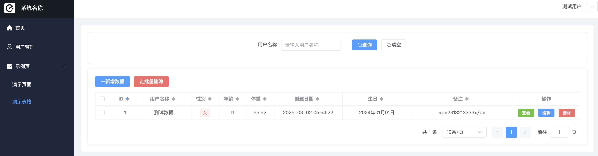
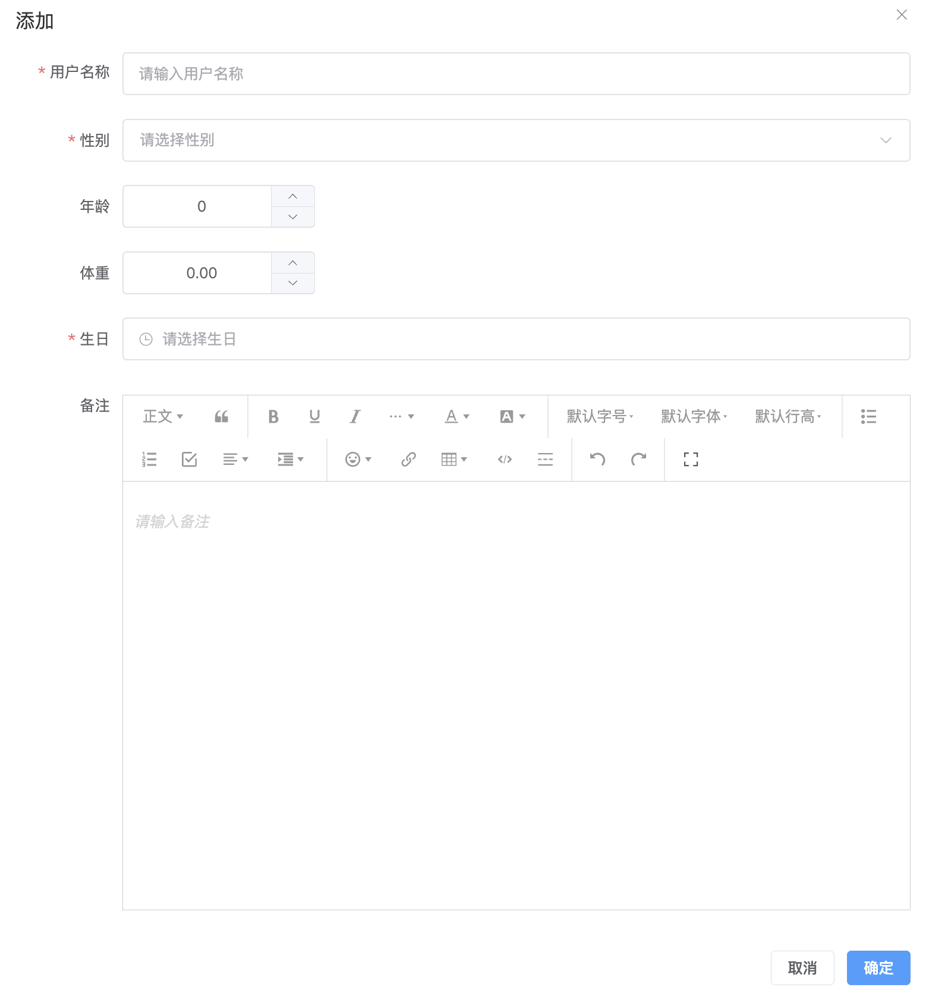
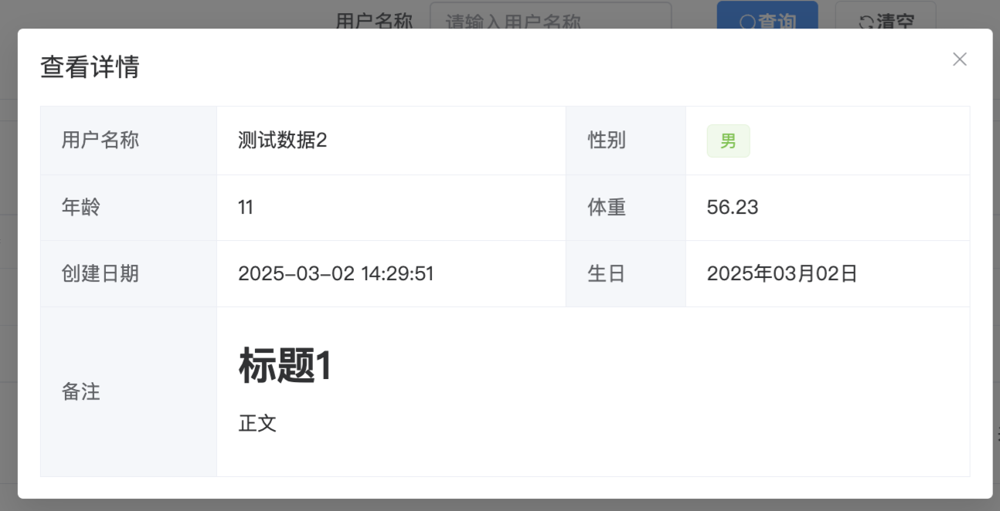

# vue3.3 + vite4 + pinia + element plus
PC前端项目初始化模板，用于快速开发后台管理项目

## 功能亮点

* 用户登录、修改密码
* 封装axios
* 封装pinia
* 封装dayjs
* 支持主题换肤、深色模式
* 封装远程模糊搜索框、文本域、级联下拉框
* 封装表格组件，支持数据查询、新增数据、修改数据、删除数据、分页、批量操作
* 封装excel组件，支持数据批量导入与导出

## 项目截图

* 登录页
  
* 首页
  
* 演示页
  
* 表格页
  
  
  
## 开发与运行

### 后端项目

* 仓库地址：
https://github.com/kylin-lawliet/blackcat-scaffolding-quick.git

* 项目简介：
一个基于Spring Boot & MyBatis的种子项目，用于快速构建中小型API、RESTful API项目。 下载代码后，可直接添加业务业务模块代码，快速开启SpringBoot单体项目。

### 安装依赖
```
npm install
```

### 开发模式调试
```
npm run dev
```

### 打包项目
```
npm run build
```

### 运行项目
```
docker build -t vue:v1 .
docker run --name vue -d -p 80:80 vue:v1
```
